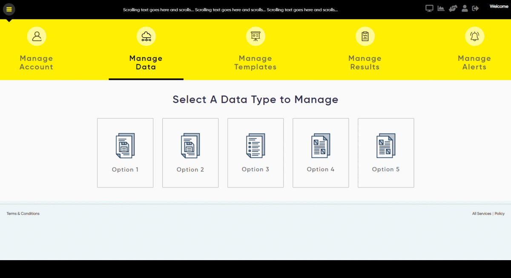

# Custom-Management-System⚙️

🚀 [Live Version](https://custom-management.netlify.app/ "Custom-Management"): https://custom-management.netlify.app/

---

📃 Description:

    This project handles a huge amount of user data and visualizes data in complex tables and various graphs.

📓 Features:

    - Custom Design and Animations
    - Loading Skeleton
    - Animated Gauge
    - Graphs (Line Charts)
    - Drag and Drop
    - CSV reading and Visualizing
    - Progress Bar
    - Modals Popups
    - Custom Code editor

---

⚙️ Technologies:

    Frontend: HTML, CSS, JavaScript, jQuery

---

🧑‍🤝‍🧑 Contributions:

- [**Ashiqul Islam**](https://github.com/ashiqul33 "Ashiqul GitHub")
- [**Shefat Hossain**](https://github.com/sifathossain39 "Shefat GitHub")
- [**Tanvir Ahmed**](https://github.com/tanvir1418 "Tanvir GitHub")

---

📷 Screen Shots:

## **Home:**

